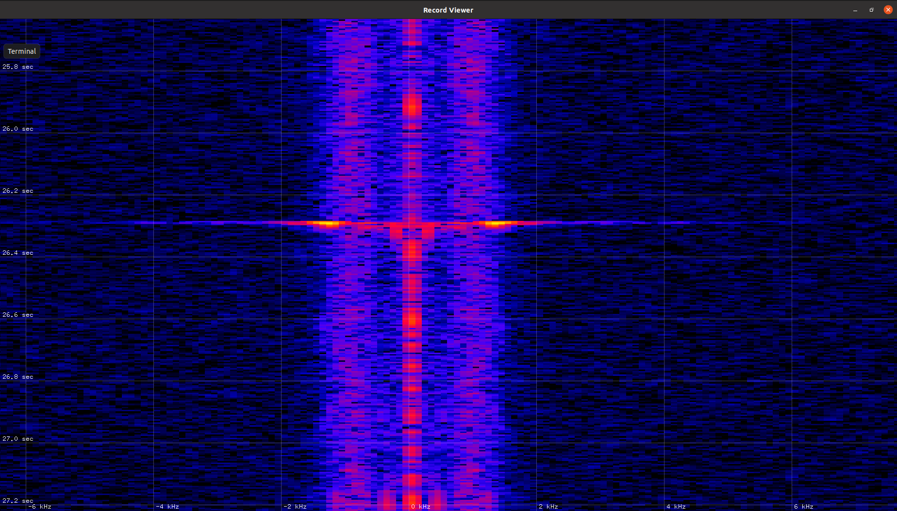

# DISTROMETER01

Mobile piezoelectric [distrometer](https://en.wikipedia.org/wiki/Disdrometer) used to distinguishing between rain, graupel, and hail during scientific thunderstorm observation.

The signal digitalization is based on high-precision [sdr-widget](https://wiki.mlab.cz/doku.php?id=cs:sdr-widget) technology, which allows sophisticated signal processing.

Distrometer sensor is mounted in the standard [TK PS 99-6-o 11040301 mounting box](https://www.spelsberg.com/industrial-housing/with-/-without-metric-knock-outs/11040301/).

### Prerequisites

The DISTROMETER01 device uses hpsdr protocol of sdr-widget. Therefore the [signal-piping-tools](https://github.com/MLAB-project/signal-piping-tools), are needed to read data from the sensor. The signal-piping-tools repository is included as submodule in this distrometer repository. Therefore it could be dowloaded by following commands from this repository.

    git submodule init
    git submodule update

After that the signal-piping-tools sources should be downloaded in "sw/signal-piping-tools"

    cd sw/signal-piping-tools

Then proceed according to README.md in that directory. eg.

    $ sudo apt-get install  sox build-essential  libusb-dev libusb-1.0-0-dev  python-setuptools  libcfitsio-dev buffer pv ntp libvolk2-dev

### Usage

    sudo apt-get install sox

The directory sw contains a submodule with required dependency `signal-piping-tools`, which needs to be build prior start of distrometer recording script. After that the recording could be start by.

    ./start.sh

There should be edited the 'station' variable in the script. The script automatically records five minutes long raw WAV files named by system time.

#### Function verification

The wav files recorded by the scripts, could by displayed as spectrogram by [pysdr-waterfall](https://github.com/MLAB-project/pysdr) utility.

### Troubleshooting

#### Unable to connect to proper PID and VID device

The USB device with ID `fffe:0007`  needs to be accesible by user using the scripts.

    $ lsusb
    Bus 001 Device 004: ID 1546:01a6 U-Blox AG
    Bus 001 Device 003: ID fffe:0007

 There is valid sdr-widget device on bus 001 and port number 003. Listing of devices on that bus shows it has correct acces rights crw-rw-rw- therefore is available for all users for read and write.  

    $ ls -la /dev/bus/usb/001/
    total 0
    drwxr-xr-x 2 root root    120 Jan  1  1970 .
    drwxr-xr-x 4 root root     80 Jan  1  1970 ..
    crw-rw-r-- 1 root root 189, 0 Feb 11  2016 001
    crw-rw-r-- 1 root root 189, 1 Feb 11  2016 002
    crw-rw-rw- 1 root root 189, 2 Dec 28 09:53 003
    crw-rw-r-- 1 root root 189, 3 Feb 11  2016 004
