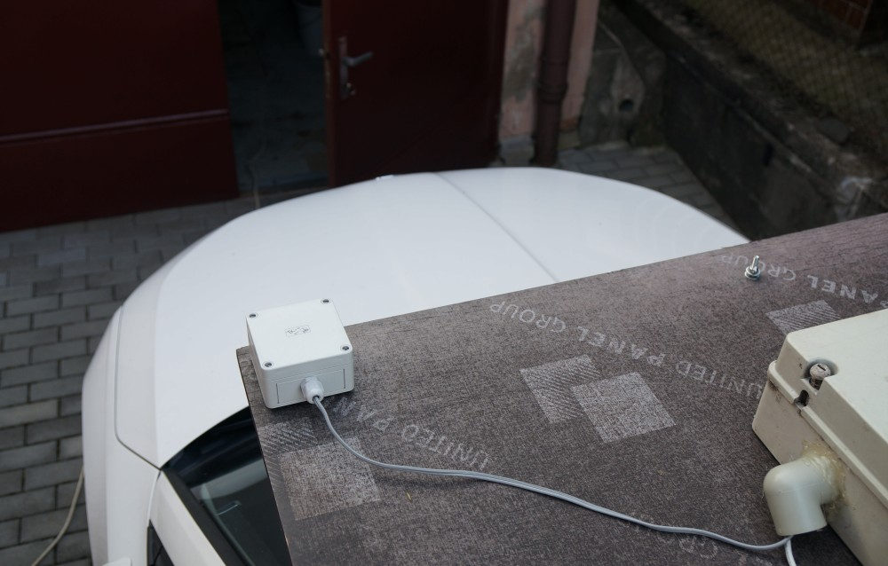

# DISTROMETER01
Mobile piezoelectric [distrometer](https://en.wikipedia.org/wiki/Disdrometer) used to distinguishing between rain, graupel, and hail during scientific thunderstorm observation.

The signal digitalization is based on high-precision [sdr-widget](https://wiki.mlab.cz/doku.php?id=cs:sdr-widget) technology, which allows sophisticated signal processing.

Distrometer sensor is mounted in the standard TK PS 99-6-o 110 403 01 mounting box.

### Usage

    sudo apt-get install sox

The directory sw contains a submodule with required dependency "signal-piping-tools", which needs to be build prior start of distrometer recording script. 

    ./start.sh 
